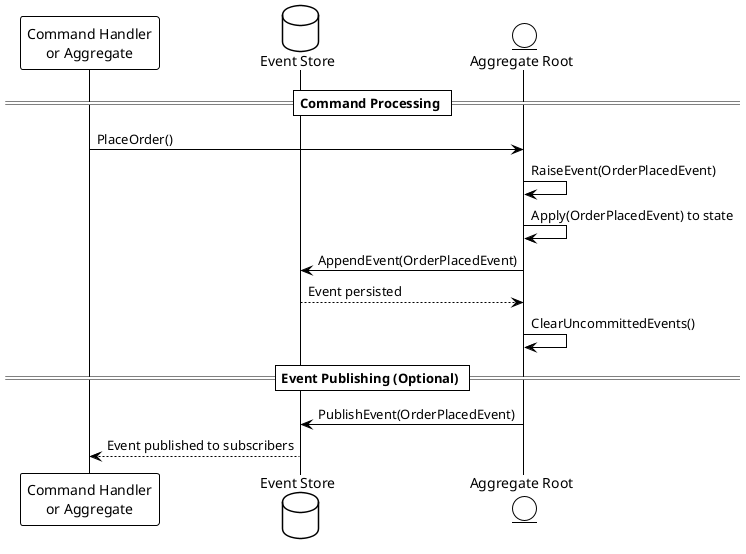

# Command Processing Flow

```plantuml
@startuml
!theme plain

participant "Command Handler\nor Aggregate" as CH
database "Event Store" as ES
entity "Aggregate Root" as AR

== Command Processing ==
CH -> AR : PlaceOrder()
AR -> AR : RaiseEvent(OrderPlacedEvent)
AR -> AR : Apply(OrderPlacedEvent) to state
AR -> ES : AppendEvent(OrderPlacedEvent)
ES --> AR : Event persisted
AR -> AR : ClearUncommittedEvents()

== Event Publishing (Optional) ==
AR -> ES : PublishEvent(OrderPlacedEvent)
ES --> CH : Event published to subscribers

@enduml

```

