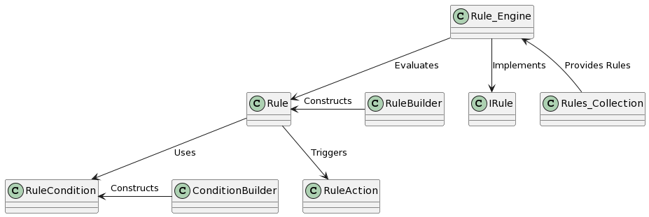
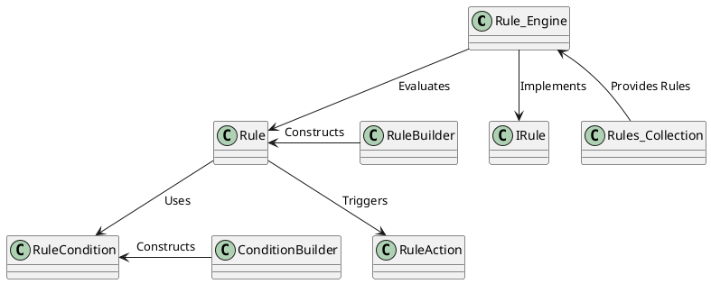

# Data Flow Diagrams (DFD)

```plantuml
@startuml
!define RECTANGLE class

skinparam rectangle {
    BackgroundColor PaleGreen
    BorderColor DarkGreen
}

RECTANGLE Rule_Engine
RECTANGLE IRule
RECTANGLE Rule
RECTANGLE RuleCondition
RECTANGLE RuleAction
RECTANGLE ConditionBuilder
RECTANGLE RuleBuilder
RECTANGLE Rules_Collection

Rule_Engine -down-> IRule : Implements
Rule_Engine -down-> Rule : Evaluates
Rule -down-> RuleCondition : Uses
Rule -down-> RuleAction : Triggers
ConditionBuilder -right-> RuleCondition : Constructs
RuleBuilder -left-> Rule : Constructs
Rules_Collection -up-> Rule_Engine : Provides Rules

@enduml

```